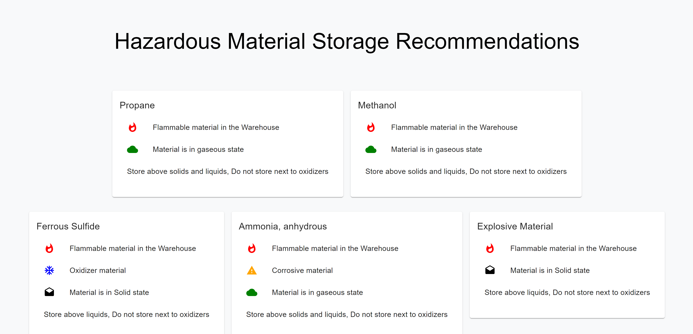
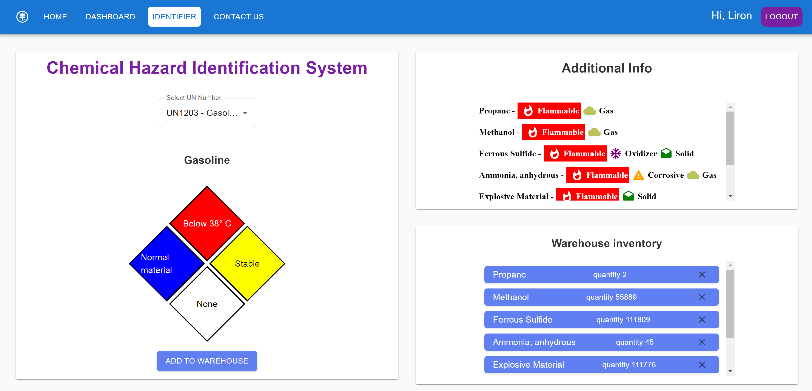

# Safe T App
Manage and monitor chemical safety in your workspace!

## Site's Link
[Safe T App - Your Safety Partner](https://safe-t-app.netlify.app/)

## About
Safe T App is a web application built using React, designed for managing and monitoring hazardous materials in a professional environment. The app offers a user-friendly interface for tracking chemicals, ensuring safety protocols, and providing essential safety information.

## Features
Chemical Dashboard: Interactive interface for monitoring and managing chemicals.
Hazardous Material Identification: Details hazardous characteristics of chemicals.
Safety Recommendations: Offers storage and handling recommendations for each chemical.
Responsive Design: Fully functional on both desktop and mobile devices.
User Access
Demo Account:
Username: demo@safetapp.com
Password: safe123
Note: This is a demo account with limited access.

## Site's Preview

## Note
The Safe T App is in active development and is regularly updated with new features and improvements.

## Languages and Tools
React
Material-UI
JavaScript
CSS
HTML
Acknowledgements
Hosted with [Your Hosting Service].
Chemical data powered by [Relevant Database/API].
Contributing
Contributions, issues, and feature requests are welcome. Feel free to check the issues page for ways to contribute.

## Author
### [Liron sifado] - https://github.com/LironSif
